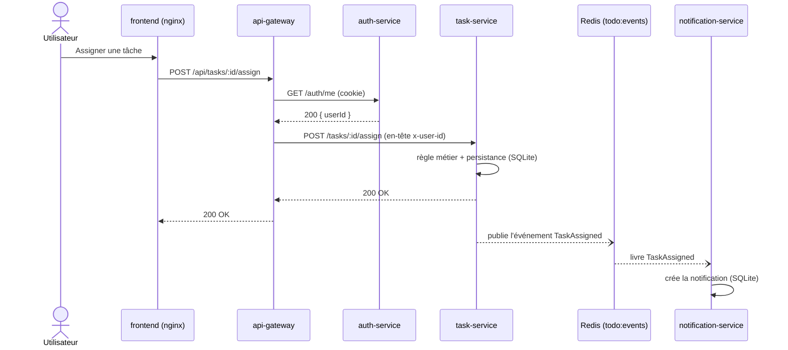

# Stratégie de tests automatisés — Projet Refacto (microservices)

> Rapport pour l'épreuve « Stratégie de tests automatisés ».
> Document complet : **Parties 1, 2 et 3 rédigées**.

---

# Partie 1 — Description de l'architecture

## 1.1 Vue d'ensemble

Le projet est une application de **gestion de projets et de tâches** refondue d'un monolithe vers une **architecture microservices** en **monorepo** (npm workspaces, TypeScript, Node 24). Le système est composé de **quatre services métier** (auth, project, task, notification), d'une **passerelle d'API** (api-gateway), d'un **frontend** et d'un **broker de messages** (Redis).

Chaque service est autonome : il possède son propre domaine métier, sa propre base de données et son propre cycle de vie (image Docker dédiée). Les services ne s'appellent **jamais directement** entre eux : la communication métier passe par des **événements** via un broker.

## 1.2 Composants principaux

| Composant | Rôle | Port | Persistance |
|---|---|---|---|
| **frontend** | Interface React (servie par nginx, qui fait aussi reverse proxy de `/api`) | 3000 (hôte) → 80 | — |
| **api-gateway** | Point d'entrée unique : authentification + routage vers les services | 3000 (interne) | — |
| **auth-service** | Comptes utilisateurs et sessions (register, login, logout, `/me`) | 3004 | SQLite (users) ; sessions en mémoire |
| **project-service** | Projets, membres, clôture | 3001 | SQLite |
| **task-service** | Tâches (création, affectation, complétion, réouverture, suppression) | 3002 | SQLite |
| **notification-service** | Génération et stockage des notifications | 3003 | SQLite |
| **redis** | Broker de messages Redis Streams (`todo:events`) | 6379 | en mémoire |

Chaque service backend suit un découpage **Domain-Driven Design** :
- `domain/` : logique métier **pure**, sans dépendance d'infrastructure (règle vérifiée par dependency-cruiser : pas de `sqlite3`, `express`, etc. dans le domaine) ;
- `ports/` : interfaces de persistance (ex. `UserRepository`, `TaskRepository`) ;
- `persistence/` : deux implémentations par port — **SQLite** (exécution réelle) et **InMemory** (tests) — choisies par une *factory* selon `NODE_ENV` ;
- `use-cases/` : cas d'usage métier (ex. `closeProject`, `assignTask`) ;
- `routes/` : exposition HTTP (Express), qui reçoit le repository par injection.

## 1.3 Interactions entre composants

Deux modes de communication coexistent :

**a) Synchrone — HTTP (requêtes utilisateur)**
1. Le **frontend** appelle `/api/...` ; **nginx** sert les fichiers statiques et fait office de **reverse proxy** vers l'`api-gateway`.
2. L'**api-gateway** authentifie chaque requête en appelant `auth-service` (`GET /auth/me`), puis injecte l'identité (`x-user-id`) et **relaie** la requête au service concerné (project, task, notification).
3. Le service traite la requête, lit/écrit dans **sa** base SQLite, et répond.

**b) Asynchrone — événementiel (communication inter-services)**
- Les services publient des **événements métier** dans un **Redis Stream** unique (`todo:events`). Types : `TaskCreated`, `TaskAssigned`, `TaskCompleted`, `TaskReopened`, `TaskDeleted`, `ProjectClosed`.
- Chaque message contient `type`, `payload` et `timestamp` (ISO 8601). Le champ `type` route vers le bon handler.
- Le **notification-service** **consomme** ces événements et crée les notifications correspondantes (ex. `TaskAssigned` → notifier l'assigné, sauf si l'auteur est aussi le destinataire).

Ce découplage événementiel signifie qu'un service producteur (task, project) **ne connaît pas** le notification-service : il publie un fait, sans savoir qui le consomme.

## 1.4 Schéma d'architecture


Pour illustrer la **coexistence des deux modes de communication** sur un parcours concret (l'affectation d'une tâche, repris en Partie 3), voici le diagramme de séquence correspondant. Les flèches pleines sont **synchrones** (HTTP), les flèches en pointillés sont **asynchrones** (événement via Redis) :



> Ce schéma montre que la **réponse à l'utilisateur ne dépend pas** de la production de la notification : le task-service répond immédiatement (synchrone), puis la notification est traitée **en parallèle** (asynchrone). Cette caractéristique est déterminante pour notre stratégie de tests (Partie 2).

## 1.5 Dépendances critiques

- **api-gateway → auth-service** : sans l'auth-service, aucune requête authentifiée ne passe (le gateway renvoie 503). C'est la dépendance synchrone la plus critique.
- **project-service / task-service / notification-service → Redis** : le broker porte la communication asynchrone (les deux premiers publient, le notification-service consomme). Si Redis est indisponible, les notifications ne sont plus produites — mais les opérations métier locales (créer, clôturer, etc.) restent possibles. *(L'auth-service ne dépend pas du broker : il gère ses sessions en mémoire via `express-session`. Le `REDIS_URL` et le `depends_on: redis` déclarés pour lui dans `docker-compose.yml` sont aujourd'hui inutilisés.)*
- **notification-service → événements de task/project** : il n'a de sens que s'il reçoit les événements ; il est *consommateur* et dépend du contrat d'événements partagé.
- **frontend → api-gateway** : le front ne parle qu'à la gateway (jamais aux services directement).

## 1.6 Frontières du système

- **Interne** : frontend, api-gateway, les 4 services métier, Redis et les bases SQLite. Tout est conteneurisé (Docker Compose) et déployé ensemble.
- **Externe** : aucune API tierce métier n'est consommée. Les seules dépendances externes sont **techniques** : le registre d'images (GHCR) et la plateforme de CI (GitHub Actions), hors du périmètre d'exécution applicatif.

> **Conséquence pour la stratégie de tests (lien Partie 2)** : comme nous **contrôlons l'intégralité** des composants (pas de service tiers non maîtrisé), nous pouvons privilégier des **vraies implémentations en conteneur** pour les tests de bout en bout, plutôt que de tout simuler.

---

# Partie 2 — Stratégie de tests

Cette partie justifie nos choix de tests en les **reliant aux caractéristiques d'architecture** décrites en Partie 1 et en **assumant explicitement les compromis**. C'est la partie la plus argumentée (la plus pondérée de l'évaluation) : pour chaque décision (niveau de test, doublure, place dans la CI), nous disons *pourquoi* ce choix et *ce qu'il laisse de côté*.

## 2.1 Choix du niveau de tests (pyramide)

Notre stratégie adopte une **pyramide de tests classique** : une large base de tests **unitaires**, une couche intermédiaire et plus réduite de tests d'**intégration**, et un sommet volontairement étroit de tests **E2E**. Cette forme n'est pas un réflexe : elle découle directement de l'architecture décrite en Partie 1. L'essentiel de la valeur et donc du risque réside dans des **règles métier isolées dans le domaine** (Partie 1.2), que l'on peut vérifier à très bas coût sans aucune infrastructure. Les niveaux supérieurs sont alors réservés à ce que l'isolation ne peut pas prouver : le câblage interne d'un service, puis l'intégration verticale de toute la stack.

### Niveau unitaire — la base de la pyramide

**Ce qu'on teste.** La **logique métier des use-cases**, service par service, en injectant un repository **InMemory** et un event bus **InMemory** (conformément au découpage DDD de la Partie 1.2). Concrètement, nos specs Jest couvrent : `project-service/spec/use-cases/` (`createProject`, `updateProject`, `closeProject`, `addMember`, `removeMember` avec des règles comme « seul le **propriétaire** clôture », les conflits et le `NOT_FOUND`) ; `task-service/spec/use-cases/` (`createTask`, `assignTask`, `completeTask`, `reopenTask`, `deleteTask`, `updateTask`) ; `auth-service/spec/userRepository.spec.ts` (test du **port** de persistance) ; et `notification-service/spec/` (`createNotificationIfAllowed`, qui porte la règle « pas de notification à soi-même », ainsi que `notificationRepository`).

**Ce qu'on ne teste pas à ce niveau.** La vraie base SQLite, le vrai Redis et le câblage HTTP. Cette frontière est volontaire : la déléguer aux niveaux supérieurs évite la **duplication** et préserve ce qui fait la valeur de l'unitaire, des tests **rapides et déterministes**, exécutables à chaque modification.

**Volume et justification.** C'est le niveau le plus fourni. Sur nos ~16 fichiers de specs (project ×5, task ×6, auth ×2, notification ×3), la grande majorité sont des **tests unitaires de use-cases**. Ce poids est justifié par une architecture **riche en règles métier** (autorisations, transitions d'état, conflits) qui se prêtent précisément à une vérification en isolation (voir l'Exemple A en Partie 3).

### Niveau intégration — la couche intermédiaire

**Ce qu'on teste.** Le **câblage entre composants internes d'un même service**, là où une fonction prise isolément ne suffit plus. Deux cas représentatifs : `notification-service/spec/eventHandlers.integration.spec.ts` valide la chaîne **event bus → handlers → repository** (un événement `TaskAssigned` crée bien la notification attendue) ; `auth-service/spec/authRoutes.spec.ts` exerce les **routes Express via supertest**, donc les entrées/sorties HTTP du service.

**Ce qu'on ne teste pas à ce niveau.** La communication **inter-services réelle** : ces tests s'arrêtent à la frontière d'un service et utilisent encore un event bus InMemory, pas le vrai Redis Streams. La livraison effective d'un service producteur à un service consommateur relève donc de l'E2E.

**Volume et justification.** Modéré. Cette couche n'a de sens que là où l'assemblage interne porte un risque propre, typiquement le notification-service, qui est par nature un **consommateur d'événements** (Partie 1.3) et dont la valeur réside dans le câblage *événement → handler → stockage* (voir l'Exemple B en Partie 3).

### Niveau E2E — le sommet

**Ce qu'on teste.** Des **parcours utilisateur complets sur la stack réelle** (Playwright contre un `docker compose up`), traversant donc nginx, l'api-gateway, les services, le **vrai Redis** et la **vraie SQLite**. Nos specs `tests/e2e/microservices/` couvrent `auth-flow` (connexion), `project-tasks` (CRUD projet/tâche), `task-actions` (terminer/réouvrir, assigner/désassigner, supprimer, clôturer) et `notifications` (consultation et déclenchement des parcours).

**Ce qu'on ne teste pas (lacune assumée).** Tous les cas limites, trop coûteux à ce niveau. **Surtout** : les scénarios « notification » **déclenchent** le parcours asynchrone (assignation, complétion, clôture) mais **n'assertent pas la livraison réelle de la notification** côté destinataire l'assignation y vise un `userId` aléatoire, différent de l'utilisateur connecté. La chaîne événementielle est donc **exécutée** mais **pas vérifiée de bout en bout**. C'est une zone de risque que nous reconnaissons explicitement (détaillée dans l'Exemple C en Partie 3).

**Volume et justification.** Le plus faible. Ces tests sont **lents** (build des images, démarrage de la stack) et plus **fragiles** (timing de l'UI) ; on s'en tient donc à quelques parcours critiques représentatifs.

> **Pourquoi une pyramide et pas un *trophée* ?** Parce que notre valeur se concentre dans les **règles métier**, testables unitairement à bas coût et de façon déterministe : il serait inutilement coûteux et redondant d'épaissir la couche intégration ou E2E pour les couvrir. Le **seul vrai risque d'intégration** est la communication **asynchrone via Redis** (caractéristique structurante de l'architecture, Partie 1.3) : elle est aujourd'hui **exercée** en E2E mais sa **livraison n'est pas encore assertée** (cf. niveau E2E ci-dessus et Exemple C). C'est, en toute honnêteté, l'**axe d'amélioration prioritaire** de notre couverture.

## 2.2 Gestion des dépendances externes

Notre système ne consomme **aucune API tierce métier** (Partie 1.6) : les seules dépendances que nos tests doivent neutraliser sont **techniques et internes** (base de données, broker, service d'authentification). Pour chacune, nous choisissons une doublure selon un principe constant, déjà posé en 2.1 : privilégier la **vitesse** et le **déterminisme** aux niveaux bas de la pyramide, et conserver la **vérité** des implémentations réelles en E2E.

### Base de données — SQLite

**Doublure retenue.** Une vraie implémentation en mémoire, écrite à la main (`persistence/inMemory.ts`), qui respecte **exactement le même port** que l'implémentation SQLite (`TaskRepository`, `UserRepository`, etc.). Une *factory* (`persistence/index.ts`) choisit l'une ou l'autre selon `NODE_ENV` : l'InMemory quand `NODE_ENV === 'test'`, la SQLite sinon.

**Pourquoi ce choix.** Cette doublure est un *fake* fidèle au contrat, pas un mock générique : elle se comporte comme un vrai dépôt (lecture, écriture, recherche) mais sans fichier ni accès disque. Les tests unitaires restent ainsi rapides et déterministes tout en exerçant la logique métier à travers une interface **identique** à celle de production.

**Compromis assumé.** Le fake InMemory peut **diverger** du SQLite réel sur les comportements propres au moteur (contraintes, typage, unicité). Ce risque est délibérément reporté sur le niveau E2E, où la vraie base SQLite tourne dans le conteneur (cf. 2.1, niveau E2E).

### Broker de messages — Redis Streams

**Doublure retenue.** Un **event bus InMemory** (`eventBus/inMemory.ts`) pour l'unitaire et l'intégration ; le **vrai Redis Streams** (`eventBus/redisEventBus.ts`) en E2E.

**Pourquoi ce choix.** Aux niveaux bas, ce qui nous intéresse est la **logique des handlers** et le câblage interne du service (Exemple B), pas la mécanique du broker. Le bus InMemory permet d'émettre un événement et d'observer son effet sur le repository sans dépendre d'une infrastructure externe.

**Compromis assumé.** Les sémantiques réelles de Redis Streams (consumer groups, garantie *at-least-once*, ordre des messages, reprise sur incident) ne sont pas couvertes par le bus InMemory. Elles ne sont exercées qu'en E2E, où leur **livraison de bout en bout n'est pas encore assertée** (lacune déjà posée en 2.1 et reprise dans l'Exemple C). Cela reste cohérent avec le fait que l'asynchrone via Redis est notre **principal risque d'intégration**.

### Authentification — api-gateway vers auth-service

**Doublure cible : un mock de framework.** Le gateway authentifie chaque requête en appelant `GET /auth/me` via la fonction `forwardJson` (`infra/httpClient.ts`), utilisée par le middleware `requireAuthGateway`. Pour tester ce middleware en isolation, l'approche visée est de **mocker `forwardJson` avec Jest** (`jest.mock` / `jest.fn`) afin de simuler les réponses de l'auth-service (200 avec identité, 401/403, ou indisponibilité aboutissant à un 503) sans démarrer réellement l'auth-service. C'est le **seul endroit** où nous recourons à un *mock généré par le framework* plutôt qu'à un *fake* écrit à la main : la frontière à isoler est ici un **appel HTTP sortant unique**, qu'un `jest.fn()` remplace plus simplement qu'une implémentation de port complète.

**Pourquoi ce choix, et risque accepté.** La valeur à vérifier ici est la **logique du middleware** : injection de l'en-tête `x-user-id` en cas de succès, propagation des statuts d'erreur, et **repli en 503** quand l'auth-service est injoignable (dépendance synchrone la plus critique, Partie 1.5). Mocker la couche HTTP isole cette logique du réseau. Le **risque assumé** est celui, classique, des mocks de framework : le mock **fige notre hypothèse** du contrat de `/auth/me` ; si l'auth-service en modifiait le format de réponse ou les codes, le test resterait **vert à tort** (faux positif). Ce risque est atténué par l'E2E, qui exerce le **vrai** auth-service via le parcours de connexion (`auth-flow`).

**Zone de risque à assumer.** À ce jour, **l'api-gateway n'a pas de tests automatisés** (un document interne, `services/api-gateway/doc/tests-a-ajouter.md`, recense ce manque). Nous le reconnaissons explicitement comme une lacune, d'autant plus sensible que le gateway porte l'authentification de **toutes** les requêtes.

> **Argument transverse.** Comme nous **contrôlons l'intégralité** des composants et ne dépendons d'aucune API tierce non maîtrisée (Partie 1.6), nous ne subissons jamais une doublure « imposée » par un service externe. Nos doublures sont des **choix délibérés** : des fakes fidèles au contrat des ports pour la vitesse aux niveaux bas, et les implémentations réelles en conteneur pour la vérité en E2E.

## 2.3 Intégration dans le pipeline CI/CD

Notre pipeline applique à la CI le **principe *fail-fast*** posé par l'ADR 004 (`doc/ci/vue-ensemble-ci.md`) : chaque commit ne déclenche que le **moins coûteux** ; le coûteux n'est payé qu'au **merge sur `main`** ou la **nuit**. Chaque niveau de la pyramide (2.1) est ainsi placé là où son rapport coût/bénéfice est le meilleur.

| Type de test | Quand (workflow) | Bloquant ? | Temps d'exécution cible |
|---|---|---|---|
| **Unitaire + intégration (Jest), ciblés** sur les services modifiés | push de branche et PR vers `main` (`ci.yml`) | Oui, bloque la PR | **< ~5 min** (feedback court) |
| **Unitaire + intégration (tous les services)** | merge sur `main` (`main-quality.yml`) et nightly (`nightly.yml`) | Oui, bloque `main` | **quelques minutes** |
| **E2E (Playwright, stack `docker compose`)** | merge sur `main` (`main-quality.yml`) et nightly (`nightly.yml`) | Oui, bloque `main` | **plafonné à 30 min** sur `main` (`timeout-minutes: 30`), **45 min** la nuit |

### Unitaire et intégration — ciblés sur les PR

**Le mécanisme.** Sur chaque push de branche et chaque PR vers `main`, `ci.yml` ne lance les tests Jest que sur les services réellement touchés. Un premier job `detect` construit, via `dorny/paths-filter`, la **matrice des services modifiés** ; le job `services` exécute alors lint et tests **uniquement** sur ces workspaces. L'objectif est un feedback **rapide et bloquant** pour la PR, sans payer le coût d'une suite complète à chaque commit.

**Le garde-fou.** Si un fichier **global** change (lockfile racine, `tsconfig.json`, `eslint.config.mjs`, `.dependency-cruiser.js`, ou `ci.yml` lui-même), la matrice bascule sur **tous** les services (*full build*), pour ne rien laisser passer (ADR 004).

### E2E — réservés à `main` et à la nuit

**La raison.** Les tests Playwright imposent de construire les images et de démarrer toute la stack (`docker compose`), avec un vrai Redis et une vraie SQLite (cf. 2.1, niveau E2E). C'est lent et coûteux : on ne les exécute donc pas sur chaque PR, mais au merge sur `main` (`main-quality.yml`, job `e2e` plafonné à 30 minutes) et toutes les nuits (`nightly.yml`, qui démarre en plus la stack via `docker compose up -d` et attend la santé du frontend puis de Redis).

**Le compromis assumé.** Un bug que **seul** l'E2E détecte n'est attrapé qu'**après** le merge, pas sur la PR. C'est un arbitrage délibéré entre vitesse de feedback et couverture, cohérent avec le faible volume d'E2E (sommet de la pyramide).

### Parallélisme — étagement des coûts

Sur `main`, `main-quality.yml` lance **en parallèle** plusieurs jobs indépendants : tests unitaires, E2E, CodeQL, SonarCloud, vérification des licences et `npm audit` bloquant. Seul `sonarcloud` attend `unit-tests`, dont il consomme la couverture. Ce parallélisme réduit le temps total de la validation exhaustive. La CI nocturne (`nightly.yml`) va plus loin avec des scans approfondis (images Trivy, audit complet, licences sur tout le monorepo), **informatifs** (ils publient des rapports sans bloquer), alors que les tests, eux, restent bloquants.

> **En résumé**, le pipeline traduit la forme de la pyramide (2.1) en logique de coût : l'unitaire, rapide et ciblé, sert de garde-fou **bloquant sur chaque PR** ; l'E2E, lent mais fidèle, valide la **stack réelle** au merge et la nuit. Le seul prix assumé de ce choix est qu'un échec strictement E2E est détecté **après** le merge, pas avant.

---

# Partie 3 — Exemples commentés

Nous présentons trois tests représentatifs de notre stratégie, un par niveau de la pyramide. Chacun illustre une décision de la Partie 2 et son lien avec l'architecture décrite en Partie 1.

## Exemple A — Test unitaire : la clôture d'un projet (`closeProject`)

**Fichier** : `services/project-service/spec/use-cases/closeProject.spec.ts`

```ts
import { createInMemoryEventBus } from '../../src/eventBus/inMemory';
import { createRepository } from '../../src/persistence';
import { createProject, closeProject } from '../../src/use-cases';

describe('closeProject', () => {
  const repo = createRepository();          // implémentation InMemory en test
  const eventBus = createInMemoryEventBus(); // bus de test, pas de vrai Redis

  beforeAll(async () => { await repo.init(); });
  afterAll(async () => { await repo.teardown(); });
  beforeEach(() => { eventBus.clear(); });

  it('allows owner to close project', async () => {
    const create = await createProject(repo, 'Project', 'owner-1');
    const result = await closeProject(repo, eventBus, create.project.id, 'owner-1');

    expect(result.ok).toBe(true);
    expect(result.project.status).toBe('closed');

    const published = eventBus.getPublishedEvents();
    expect(published).toHaveLength(1);
    expect(published[0].type).toBe('ProjectClosed');
    expect(published[0].payload).toMatchObject({
      projectId: create.project.id,
      closedByUserId: 'owner-1',
      memberIds: ['owner-1'],
    });
  });

  it('returns FORBIDDEN when non-owner closes', async () => {
    const create = await createProject(repo, 'Project 2', 'owner-1');
    const result = await closeProject(repo, eventBus, create.project.id, 'user-other');

    expect(result.ok).toBe(false);
    expect(result.code).toBe('FORBIDDEN');
    expect(eventBus.getPublishedEvents()).toHaveLength(0);
  });
});
```

**Ce qu'il vérifie.** Ce test cible une **règle métier centrale** du domaine *project* : la clôture d'un projet. Il valide deux choses indissociables. D'abord la **règle d'autorisation** : seul le **propriétaire** peut clôturer ; un autre utilisateur reçoit `FORBIDDEN`. Ensuite l'**effet de bord métier attendu** : une clôture réussie publie **exactement un** événement `ProjectClosed` au bon format (`projectId`, `closedByUserId`, `memberIds`) — et, symétriquement, qu'une tentative refusée ne publie **aucun** événement. La suite complète couvre aussi `CONFLICT` (projet déjà clôturé) et `NOT_FOUND`.

**Pourquoi ce niveau (unitaire).** La clôture est de la **logique de domaine pure** : une décision (autorisé ou non) et un fait métier (l'événement émis). Elle ne dépend ni de HTTP, ni de la base réelle, ni du broker. En injectant un **repository InMemory** et un **event bus InMemory** (conformément à notre découpage DDD, Partie 1.2), on teste cette logique de façon **isolée, rapide et déterministe** — exactement ce qu'on veut à la base de la pyramide. Tester cette règle en E2E serait coûteux et redondant.

**Ses limites.** Le test n'exerce **pas** la persistance SQLite réelle (seulement le fake InMemory, qui peut diverger du vrai stockage), **ni** la publication réelle dans Redis Streams : il vérifie seulement que le use-case **demande** la publication du bon événement, pas qu'il arrive jusqu'au notification-service. Cette couverture-là est déléguée aux niveaux intégration et E2E. C'est un compromis assumé : on échange la fidélité de l'infrastructure contre la vitesse.

## Exemple B — Test d'intégration : la chaîne événementielle du notification-service

**Fichier** : `services/notification-service/spec/eventHandlers.integration.spec.ts`

```ts
import { createRepository } from '../src/persistence';
import { createInMemoryEventBus, type InMemoryEventBus } from '../src/eventBus/inMemory';
import { registerHandlers } from '../src/handlers';

const repo = createRepository();
const eventBus = createInMemoryEventBus();

describe('event handlers integration', () => {
  beforeAll(async () => {
    await repo.init();
    registerHandlers(eventBus, repo); // câble les handlers sur le bus + le repo
    await eventBus.start();
  });
  afterAll(async () => { await eventBus.stop(); await repo.teardown(); });

  it('TaskAssigned: creates notification for assigned user', async () => {
    await (eventBus as InMemoryEventBus).emit('TaskAssigned', {
      taskId: 't1', projectId: 'p1',
      actionUserId: 'user-ta-assigner', assignedTo: 'user-ta-assignee', title: 'Fix bug',
    });

    const notifications = await repo.findByUserId('user-ta-assignee');
    expect(notifications.length).toBe(1);
    expect(notifications[0].type).toBe('TaskAssigned');
    expect(notifications[0].message).toBe('Task "Fix bug" was assigned to you');
  });

  it('TaskAssigned: no notification when actionUserId === assignedTo', async () => {
    const before = await repo.findByUserId('user-ta-same');
    await (eventBus as InMemoryEventBus).emit('TaskAssigned', {
      taskId: 't2', projectId: 'p2', actionUserId: 'user-ta-same', assignedTo: 'user-ta-same',
    });
    const after = await repo.findByUserId('user-ta-same');
    expect(after.length).toBe(before.length);
  });
});
```

**Ce qu'il vérifie.** Ce test valide le **comportement de bout en bout *interne* au notification-service** : quand un événement `TaskAssigned` est émis sur le bus, les **handlers enregistrés** (`registerHandlers`) le traitent et **écrivent la notification dans le repository**. On vérifie l'**effet observable** côté persistance (`repo.findByUserId(...)`) : le bon destinataire, le bon type, le bon message. Le second cas vérifie une **règle métier transverse** — « pas de notification à soi-même » : si l'auteur de l'action est aussi l'assigné, **aucune** notification n'est créée.

**Pourquoi ce niveau (intégration).** Contrairement à l'exemple A qui teste une fonction isolée, ici on **assemble plusieurs composants internes** du service — le bus d'événements, l'enregistrement des handlers, et le repository — et on vérifie qu'ils **fonctionnent ensemble**. C'est précisément la définition d'un test d'intégration. Ce niveau est pertinent car le notification-service est, par nature (Partie 1.3), un **consommateur d'événements** : sa valeur réside dans le câblage *événement → handler → stockage*, qu'un test purement unitaire d'une fonction ne couvrirait pas.

**Ses limites.** L'intégration s'arrête à la **frontière du service**. On utilise un **bus InMemory**, pas le vrai **Redis Streams** : on ne teste donc ni les *consumer groups*, ni la garantie *at-least-once*, ni l'ordre ou la reprise sur incident. On ne teste pas non plus la **production réelle** de l'événement par le task-service (ici, on l'émet « à la main » via `emit`). Autrement dit, ce test prouve que *si* l'événement arrive, la notification est créée correctement — mais pas qu'il **arrive réellement** en production. Ce maillon-là relève de l'E2E.

## Exemple C — Test E2E : le cycle de vie d'une tâche sur la stack réelle

**Fichier** : `tests/e2e/microservices/task-actions.spec.ts` — test « Terminer et réouvrir une tâche »

```ts
test("Terminer et réouvrir une tâche", async ({ page }) => {
  await createProjectAndNavigateToTasks(page);

  const taskTitle = `Tâche à terminer ${Date.now()}`;
  await createTask(page, taskTitle, "medium", "todo");

  const row = page.locator("table tbody tr").filter({ hasText: taskTitle });
  await expect(row).toContainText("À faire");

  await row.getByRole("button", { name: "Terminer" }).click();
  await expect(row).toContainText("Terminé", { timeout: 5000 });

  await row.getByRole("button", { name: "Réouvrir" }).click();
  await expect(row).toContainText("À faire", { timeout: 5000 });
});
```

**Ce qu'il vérifie.** Ce test rejoue, **dans un vrai navigateur** (Playwright) et contre la **stack complète démarrée par `docker compose up`**, un parcours utilisateur réel : créer un projet, créer une tâche, la **Terminer** (l'état passe à « Terminé »), puis la **Réouvrir** (retour à « À faire »). Les assertions portent sur l'**état réellement affiché à l'écran** après chaque transition. Ce qui est traversé est toute la chaîne décrite en Partie 1.3 : navigateur → **nginx** → **api-gateway** (authentification + routage) → **task-service** → **vraie base SQLite**, puis retour jusqu'à l'UI.

**Pourquoi ce niveau (E2E).** C'est le **seul niveau** capable de prouver que tous les composants **assemblés** fonctionnent ensemble dans des conditions proches de la production : le reverse proxy, l'injection d'identité par le gateway, le routage HTTP, la persistance réelle, le rendu du front. Aucun test unitaire ou d'intégration ne couvre cette **intégration verticale** complète. On en a peu (sommet de la pyramide) car ils sont coûteux, mais celui-ci est représentatif d'un parcours critique.

**Ses limites.** Ce test est **lent** (build des images Docker, démarrage de la stack) et plus **fragile** (timing de l'UI), ce qui justifie qu'il ne tourne **que sur `main` et en nightly**, pas sur chaque PR — un échec n'est donc détecté qu'**après** le merge. En cas d'échec, la **cause est plus difficile à localiser** (beaucoup de composants en jeu). Surtout — et c'est notre **principale zone de risque** — ce test couvre le flux **synchrone HTTP** (les flèches pleines du diagramme de séquence en 1.4). La **communication asynchrone** (publication Redis par task/project → consommation par notification-service, soit la **branche en pointillés** de ce même diagramme), qui est pourtant une caractéristique structurante de notre architecture, est **déclenchée** par les specs `notifications.spec.ts` mais **sans assertion sur la notification réellement livrée** (l'assignation y vise un `userId` aléatoire, différent de l'utilisateur connecté). **La livraison événementielle de bout en bout n'est donc pas réellement vérifiée par nos E2E actuels.** Nous l'assumons comme une lacune identifiée, dont la correction est claire : se connecter avec l'utilisateur assigné et asserter l'apparition de la notification après rafraîchissement.

