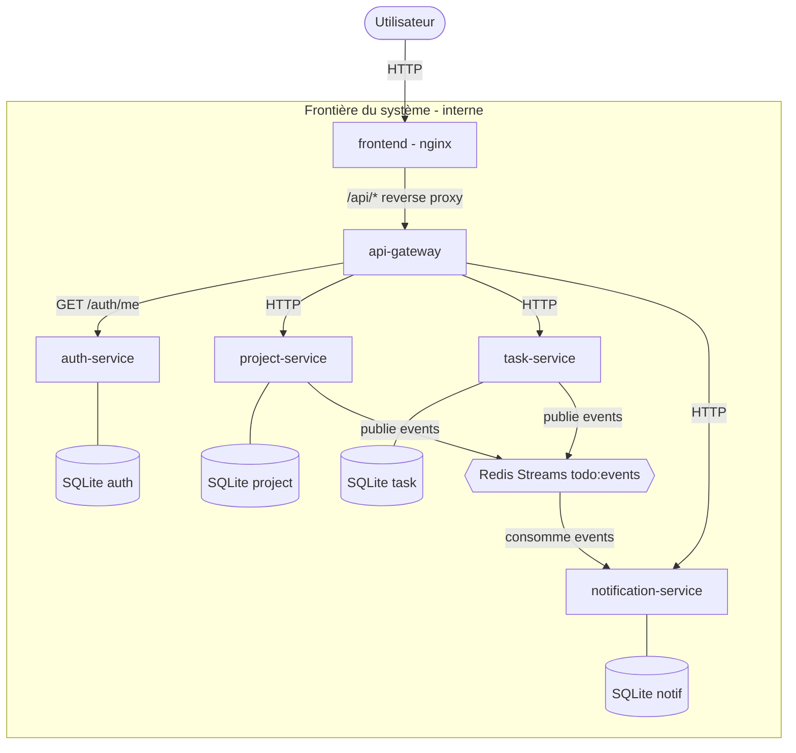
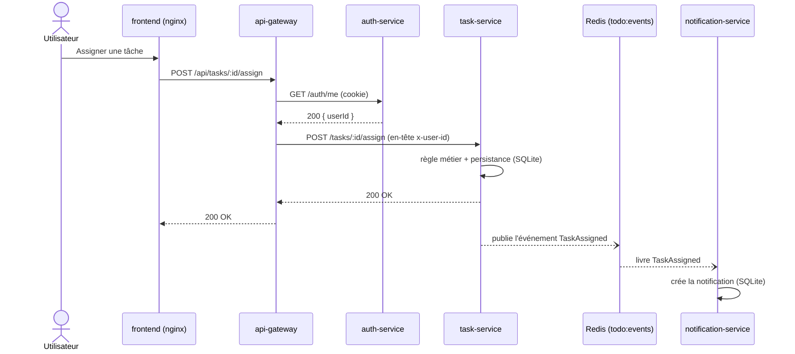

# Stratégie de tests automatisés — Projet Refacto (microservices)

> Rapport pour l'épreuve « Stratégie de tests automatisés ».
> **Parties 1 et 3 rédigées** ; **Partie 2 = plan de rédaction** (points à développer individuellement).

---

# Partie 1 — Description de l'architecture

## 1.1 Vue d'ensemble

Le projet est une application de **gestion de projets et de tâches** refondue d'un monolithe vers une **architecture microservices** en **monorepo** (npm workspaces, TypeScript, Node 24). Le système est composé de **quatre services métier** (auth, project, task, notification), d'une **passerelle d'API** (api-gateway), d'un **frontend** et d'un **broker de messages** (Redis).

Chaque service est autonome : il possède son propre domaine métier, sa propre base de données et son propre cycle de vie (image Docker dédiée). Les services ne s'appellent **jamais directement** entre eux : la communication métier passe par des **événements** via un broker.

## 1.2 Composants principaux

| Composant | Rôle | Port | Persistance |
|---|---|---|---|
| **frontend** | Interface React (servie par nginx, qui fait aussi reverse proxy de `/api`) | 3000 (hôte) → 80 | — |
| **api-gateway** | Point d'entrée unique : authentification + routage vers les services | 3000 (interne) | — |
| **auth-service** | Comptes utilisateurs et sessions (register, login, logout, `/me`) | 3004 | SQLite (users) ; sessions en mémoire |
| **project-service** | Projets, membres, clôture | 3001 | SQLite |
| **task-service** | Tâches (création, affectation, complétion, réouverture, suppression) | 3002 | SQLite |
| **notification-service** | Génération et stockage des notifications | 3003 | SQLite |
| **redis** | Broker de messages — Redis Streams (`todo:events`) | 6379 | en mémoire |

Chaque service backend suit un découpage **Domain-Driven Design** :
- `domain/` : logique métier **pure**, sans dépendance d'infrastructure (règle vérifiée par dependency-cruiser : pas de `sqlite3`, `express`, etc. dans le domaine) ;
- `ports/` : interfaces de persistance (ex. `UserRepository`, `TaskRepository`) ;
- `persistence/` : deux implémentations par port — **SQLite** (exécution réelle) et **InMemory** (tests) — choisies par une *factory* selon `NODE_ENV` ;
- `use-cases/` : cas d'usage métier (ex. `closeProject`, `assignTask`) ;
- `routes/` : exposition HTTP (Express), qui reçoit le repository par injection.

## 1.3 Interactions entre composants

Deux modes de communication coexistent :

**a) Synchrone — HTTP (requêtes utilisateur)**
1. Le **frontend** appelle `/api/...` ; **nginx** sert les fichiers statiques et fait office de **reverse proxy** vers l'`api-gateway`.
2. L'**api-gateway** authentifie chaque requête en appelant `auth-service` (`GET /auth/me`), puis injecte l'identité (`x-user-id`) et **relaie** la requête au service concerné (project, task, notification).
3. Le service traite la requête, lit/écrit dans **sa** base SQLite, et répond.

**b) Asynchrone — événementiel (communication inter-services)**
- Les services publient des **événements métier** dans un **Redis Stream** unique (`todo:events`). Types : `TaskCreated`, `TaskAssigned`, `TaskCompleted`, `TaskReopened`, `TaskDeleted`, `ProjectClosed`.
- Chaque message contient `type`, `payload` et `timestamp` (ISO 8601). Le champ `type` route vers le bon handler.
- Le **notification-service** **consomme** ces événements et crée les notifications correspondantes (ex. `TaskAssigned` → notifier l'assigné, sauf si l'auteur est aussi le destinataire).

Ce découplage événementiel signifie qu'un service producteur (task, project) **ne connaît pas** le notification-service : il publie un fait, sans savoir qui le consomme.

## 1.4 Schéma d'architecture



Pour illustrer la **coexistence des deux modes de communication** sur un parcours concret (l'affectation d'une tâche, repris en Partie 3), voici le diagramme de séquence correspondant. Les flèches pleines sont **synchrones** (HTTP), les flèches en pointillés sont **asynchrones** (événement via Redis) :



> Ce schéma montre que la **réponse à l'utilisateur ne dépend pas** de la production de la notification : le task-service répond immédiatement (synchrone), puis la notification est traitée **en parallèle** (asynchrone). Cette caractéristique est déterminante pour notre stratégie de tests (Partie 2).

## 1.5 Dépendances critiques

- **api-gateway → auth-service** : sans l'auth-service, aucune requête authentifiée ne passe (le gateway renvoie 503). C'est la dépendance synchrone la plus critique.
- **project-service / task-service / notification-service → Redis** : le broker porte la communication asynchrone (les deux premiers publient, le notification-service consomme). Si Redis est indisponible, les notifications ne sont plus produites — mais les opérations métier locales (créer, clôturer, etc.) restent possibles. *(L'auth-service ne dépend pas du broker.)*
- **notification-service → événements de task/project** : il n'a de sens que s'il reçoit les événements ; il est *consommateur* et dépend du contrat d'événements partagé.
- **frontend → api-gateway** : le front ne parle qu'à la gateway (jamais aux services directement).

## 1.6 Frontières du système

- **Interne** : frontend, api-gateway, les 4 services métier, Redis et les bases SQLite. Tout est conteneurisé (Docker Compose) et déployé ensemble.
- **Externe** : aucune API tierce métier n'est consommée. Les seules dépendances externes sont **techniques** : le registre d'images (GHCR) et la plateforme de CI (GitHub Actions), hors du périmètre d'exécution applicatif.

> **Conséquence pour la stratégie de tests (lien Partie 2)** : comme nous **contrôlons l'intégralité** des composants (pas de service tiers non maîtrisé), nous pouvons privilégier des **vraies implémentations en conteneur** pour les tests de bout en bout, plutôt que de tout simuler.

---

# Partie 2 — Stratégie de tests *(plan à développer)*

> Squelette de rédaction : points à argumenter, ancrés sur notre code. À développer (50 % de la note → la partie la plus argumentée). **Rappel barème : relier chaque choix de test à une caractéristique de l'architecture, et assumer les compromis.**

## 2.1 Choix du niveau de tests (pyramide)

**Notre forme = pyramide classique** : beaucoup d'unitaires, quelques tests d'intégration, peu d'E2E.

- **Unitaire (base, la majorité de nos tests)**
  - *Ce qu'on teste* : la **logique métier des use-cases**, service par service, avec repository **InMemory** et event bus **InMemory**.
    - `project-service/spec/use-cases/` : `createProject`, `updateProject`, `closeProject`, `addMember`, `removeMember` (règles : seul le **propriétaire** (chef de projet) clôture, conflits, `NOT_FOUND`…).
    - `task-service/spec/use-cases/` : `createTask`, `assignTask`, `completeTask`, `reopenTask`, `deleteTask`, `updateTask`.
    - `auth-service/spec/` : `userRepository` (test du port de persistance ; `authRoutes` relève de l'intégration, voir plus bas).
    - `notification-service/spec/` : `createNotificationIfAllowed` (règle « pas de notification à soi-même »), `notificationRepository`.
  - *Ce qu'on ne teste pas ici* : la vraie base SQLite, le vrai Redis, le câblage HTTP → délégué aux niveaux supérieurs (éviter la duplication, garder ces tests rapides).
  - *Volume* : le plus élevé. Sur ~16 fichiers de specs Jest (project ×5, task ×6, auth ×2, notification ×3), la grande majorité sont des **tests unitaires de use-cases**. Justifié par une architecture **riche en règles métier** isolées dans le domaine.

- **Intégration (intermédiaire, quelques tests)**
  - *Ce qu'on teste* : le **câblage entre composants internes d'un service**.
    - `notification-service/spec/eventHandlers.integration.spec.ts` : chaîne **event bus → handlers → repository** (un événement `TaskAssigned` crée bien la notification).
    - `auth-service/spec/authRoutes.spec.ts` : routes Express via **supertest** (entrées/sorties HTTP).
  - *Ce qu'on ne teste pas* : la communication **inter-services réelle** (via vrai Redis) → couverte en E2E.
  - *Volume* : modéré.

- **E2E (sommet, peu de tests)**
  - *Ce qu'on teste* : des **parcours complets sur la stack réelle** (Playwright + `docker compose up`), donc gateway + services + **vrai Redis** + **vraie SQLite** + nginx.
    - `tests/e2e/microservices/` : `auth-flow` (connexion), `project-tasks` (CRUD projet/tâche), `task-actions` (terminer/réouvrir, assigner/désassigner, supprimer, clôturer), `notifications` (vues + déclenchement des parcours).
  - *Ce qu'on ne teste pas (lacune à assumer)* : tous les cas limites (trop coûteux). **Surtout** : les scénarios « notification » **déclenchent** le parcours asynchrone (assignation, complétion, clôture) mais **n'assertent pas la livraison réelle de la notification** côté destinataire (l'assignation se fait vers un `userId` aléatoire ≠ utilisateur connecté). La chaîne événementielle est donc **exécutée** mais **pas vérifiée de bout en bout** — zone de risque identifiée.
  - *Volume* : le plus faible (lent, coûteux à maintenir).

- **À argumenter** : pourquoi une **pyramide** et pas un *trophée* — notre valeur est surtout dans les **règles métier** (testables unitairement à bas coût). L'**asynchrone (Redis)** est le seul vrai risque d'intégration : il est **exercé** en E2E mais sa **livraison n'est pas encore assertée** (lacune identifiée, cf. 2.1 E2E et Partie 3 — Exemple C). C'est l'axe d'amélioration prioritaire de notre couverture.

## 2.2 Gestion des dépendances externes

Pour chaque dépendance, dire **quelle doublure** et **pourquoi** :

- **Base de données (SQLite)**
  - Approche : **vraie implémentation en mémoire** = un **fake écrit à la main** (`persistence/inMemory.ts`) qui implémente le **même port** que SQLite.
  - Pourquoi : rapide, pas de fichier, mais **fidèle au contrat** du port (≠ mock générique). En E2E, on utilise la **vraie SQLite** (Docker).
  - *Compromis assumé* : l'InMemory peut **diverger** de SQLite (contraintes SQL, types) → risque couvert par l'E2E.

- **Broker (Redis Streams)**
  - Approche : **event bus InMemory** (`eventBus/inMemory.ts`) pour l'unitaire et l'intégration ; **vrai Redis** en E2E.
  - Pourquoi : tester la **logique des handlers** sans dépendre de l'infra broker.
  - *Compromis assumé* : les sémantiques réelles (consumer groups, at-least-once, ordre) ne sont pas testées au niveau unitaire → vérifiées en E2E.

- **Authentification (api-gateway → auth-service `/auth/me`)**
  - Approche cible : **doublure de `forwardJson`** (mock du module HTTP) pour tester le middleware d'auth en isolation.
  - *Zone de risque à assumer* : **l'api-gateway n'a pas encore de tests** (lacune identifiée, carte dédiée). À reconnaître explicitement (le barème valorise l'honnêteté sur les lacunes).

- **Argument transverse fort** : **aucune API tierce non maîtrisée** → on n'a pas besoin de fakes « subis ». On choisit nos doublures pour la **vitesse** (unitaire) et on garde la **vérité** en conteneur (E2E).

## 2.3 Intégration dans le pipeline CI/CD

S'appuyer sur nos workflows réels (`doc/ci/vue-ensemble-ci.md`, ADR 004) :

| Type de test | Quand | Contrainte | Temps cible |
|---|---|---|---|
| **Unitaire + intégration (Jest)** | **PR / push de branche** (`ci.yml`), **ciblés** sur les services modifiés | **Bloquant** pour la PR | < ~5 min |
| **Unitaire + intégration (tous)** | **merge sur main** (`main-quality.yml`) | Bloquant sur main | — |
| **E2E (Playwright)** | **merge sur main** + **nightly** | Job **séparé/parallèle** ; bloquant sur main | le plus long (build Docker) |

- **À argumenter** :
  - *Pourquoi les E2E ne tournent pas sur chaque PR* : coût (`docker compose up --build`), lenteur → on les réserve à main et à la CI nocturne. **Compromis assumé** : un bug E2E n'est attrapé **qu'après** le merge, pas sur la PR.
  - *Pourquoi l'unitaire est ciblé sur les PR* : feedback rapide, on ne teste que ce qui change (matrix `dorny/paths-filter`), garde-fou *full build* si fichier global modifié.
  - *Parallélisme sur main* : E2E, CodeQL, Sonar tournent en jobs parallèles pour réduire le temps total.

---

# Partie 3 — Exemples commentés

Nous présentons trois tests représentatifs de notre stratégie, un par niveau de la pyramide. Chacun illustre une décision de la Partie 2 et son lien avec l'architecture décrite en Partie 1.

## Exemple A — Test unitaire : la clôture d'un projet (`closeProject`)

**Fichier** : `services/project-service/spec/use-cases/closeProject.spec.ts`

```ts
import { createInMemoryEventBus } from '../../src/eventBus/inMemory';
import { createRepository } from '../../src/persistence';
import { createProject, closeProject } from '../../src/use-cases';

describe('closeProject', () => {
  const repo = createRepository();          // implémentation InMemory en test
  const eventBus = createInMemoryEventBus(); // bus de test, pas de vrai Redis

  beforeAll(async () => { await repo.init(); });
  afterAll(async () => { await repo.teardown(); });
  beforeEach(() => { eventBus.clear(); });

  it('allows owner to close project', async () => {
    const create = await createProject(repo, 'Project', 'owner-1');
    const result = await closeProject(repo, eventBus, create.project.id, 'owner-1');

    expect(result.ok).toBe(true);
    expect(result.project.status).toBe('closed');

    const published = eventBus.getPublishedEvents();
    expect(published).toHaveLength(1);
    expect(published[0].type).toBe('ProjectClosed');
    expect(published[0].payload).toMatchObject({
      projectId: create.project.id,
      closedByUserId: 'owner-1',
      memberIds: ['owner-1'],
    });
  });

  it('returns FORBIDDEN when non-owner closes', async () => {
    const create = await createProject(repo, 'Project 2', 'owner-1');
    const result = await closeProject(repo, eventBus, create.project.id, 'user-other');

    expect(result.ok).toBe(false);
    expect(result.code).toBe('FORBIDDEN');
    expect(eventBus.getPublishedEvents()).toHaveLength(0);
  });
});
```

**Ce qu'il vérifie.** Ce test cible une **règle métier centrale** du domaine *project* : la clôture d'un projet. Il valide deux choses indissociables. D'abord la **règle d'autorisation** : seul le **propriétaire** peut clôturer ; un autre utilisateur reçoit `FORBIDDEN`. Ensuite l'**effet de bord métier attendu** : une clôture réussie publie **exactement un** événement `ProjectClosed` au bon format (`projectId`, `closedByUserId`, `memberIds`) — et, symétriquement, qu'une tentative refusée ne publie **aucun** événement. La suite complète couvre aussi `CONFLICT` (projet déjà clôturé) et `NOT_FOUND`.

**Pourquoi ce niveau (unitaire).** La clôture est de la **logique de domaine pure** : une décision (autorisé ou non) et un fait métier (l'événement émis). Elle ne dépend ni de HTTP, ni de la base réelle, ni du broker. En injectant un **repository InMemory** et un **event bus InMemory** (conformément à notre découpage DDD, Partie 1.2), on teste cette logique de façon **isolée, rapide et déterministe** — exactement ce qu'on veut à la base de la pyramide. Tester cette règle en E2E serait coûteux et redondant.

**Ses limites.** Le test n'exerce **pas** la persistance SQLite réelle (seulement le fake InMemory, qui peut diverger du vrai stockage), **ni** la publication réelle dans Redis Streams : il vérifie seulement que le use-case **demande** la publication du bon événement, pas qu'il arrive jusqu'au notification-service. Cette couverture-là est déléguée aux niveaux intégration et E2E. C'est un compromis assumé : on échange la fidélité de l'infrastructure contre la vitesse.

## Exemple B — Test d'intégration : la chaîne événementielle du notification-service

**Fichier** : `services/notification-service/spec/eventHandlers.integration.spec.ts`

```ts
import { createRepository } from '../src/persistence';
import { createInMemoryEventBus, type InMemoryEventBus } from '../src/eventBus/inMemory';
import { registerHandlers } from '../src/handlers';

const repo = createRepository();
const eventBus = createInMemoryEventBus();

describe('event handlers integration', () => {
  beforeAll(async () => {
    await repo.init();
    registerHandlers(eventBus, repo); // câble les handlers sur le bus + le repo
    await eventBus.start();
  });
  afterAll(async () => { await eventBus.stop(); await repo.teardown(); });

  it('TaskAssigned: creates notification for assigned user', async () => {
    await (eventBus as InMemoryEventBus).emit('TaskAssigned', {
      taskId: 't1', projectId: 'p1',
      actionUserId: 'user-ta-assigner', assignedTo: 'user-ta-assignee', title: 'Fix bug',
    });

    const notifications = await repo.findByUserId('user-ta-assignee');
    expect(notifications.length).toBe(1);
    expect(notifications[0].type).toBe('TaskAssigned');
    expect(notifications[0].message).toBe('Task "Fix bug" was assigned to you');
  });

  it('TaskAssigned: no notification when actionUserId === assignedTo', async () => {
    const before = await repo.findByUserId('user-ta-same');
    await (eventBus as InMemoryEventBus).emit('TaskAssigned', {
      taskId: 't2', projectId: 'p2', actionUserId: 'user-ta-same', assignedTo: 'user-ta-same',
    });
    const after = await repo.findByUserId('user-ta-same');
    expect(after.length).toBe(before.length);
  });
});
```

**Ce qu'il vérifie.** Ce test valide le **comportement de bout en bout *interne* au notification-service** : quand un événement `TaskAssigned` est émis sur le bus, les **handlers enregistrés** (`registerHandlers`) le traitent et **écrivent la notification dans le repository**. On vérifie l'**effet observable** côté persistance (`repo.findByUserId(...)`) : le bon destinataire, le bon type, le bon message. Le second cas vérifie une **règle métier transverse** — « pas de notification à soi-même » : si l'auteur de l'action est aussi l'assigné, **aucune** notification n'est créée.

**Pourquoi ce niveau (intégration).** Contrairement à l'exemple A qui teste une fonction isolée, ici on **assemble plusieurs composants internes** du service — le bus d'événements, l'enregistrement des handlers, et le repository — et on vérifie qu'ils **fonctionnent ensemble**. C'est précisément la définition d'un test d'intégration. Ce niveau est pertinent car le notification-service est, par nature (Partie 1.3), un **consommateur d'événements** : sa valeur réside dans le câblage *événement → handler → stockage*, qu'un test purement unitaire d'une fonction ne couvrirait pas.

**Ses limites.** L'intégration s'arrête à la **frontière du service**. On utilise un **bus InMemory**, pas le vrai **Redis Streams** : on ne teste donc ni les *consumer groups*, ni la garantie *at-least-once*, ni l'ordre ou la reprise sur incident. On ne teste pas non plus la **production réelle** de l'événement par le task-service (ici, on l'émet « à la main » via `emit`). Autrement dit, ce test prouve que *si* l'événement arrive, la notification est créée correctement — mais pas qu'il **arrive réellement** en production. Ce maillon-là relève de l'E2E.

## Exemple C — Test E2E : le cycle de vie d'une tâche sur la stack réelle

**Fichier** : `tests/e2e/microservices/task-actions.spec.ts` — test « Terminer et réouvrir une tâche »

```ts
test("Terminer et réouvrir une tâche", async ({ page }) => {
  await createProjectAndNavigateToTasks(page);

  const taskTitle = `Tâche à terminer ${Date.now()}`;
  await createTask(page, taskTitle, "medium", "todo");

  const row = page.locator("table tbody tr").filter({ hasText: taskTitle });
  await expect(row).toContainText("À faire");

  await row.getByRole("button", { name: "Terminer" }).click();
  await expect(row).toContainText("Terminé", { timeout: 5000 });

  await row.getByRole("button", { name: "Réouvrir" }).click();
  await expect(row).toContainText("À faire", { timeout: 5000 });
});
```

**Ce qu'il vérifie.** Ce test rejoue, **dans un vrai navigateur** (Playwright) et contre la **stack complète démarrée par `docker compose up`**, un parcours utilisateur réel : créer un projet, créer une tâche, la **Terminer** (l'état passe à « Terminé »), puis la **Réouvrir** (retour à « À faire »). Les assertions portent sur l'**état réellement affiché à l'écran** après chaque transition. Ce qui est traversé est toute la chaîne décrite en Partie 1.3 : navigateur → **nginx** → **api-gateway** (authentification + routage) → **task-service** → **vraie base SQLite**, puis retour jusqu'à l'UI.

**Pourquoi ce niveau (E2E).** C'est le **seul niveau** capable de prouver que tous les composants **assemblés** fonctionnent ensemble dans des conditions proches de la production : le reverse proxy, l'injection d'identité par le gateway, le routage HTTP, la persistance réelle, le rendu du front. Aucun test unitaire ou d'intégration ne couvre cette **intégration verticale** complète. On en a peu (sommet de la pyramide) car ils sont coûteux, mais celui-ci est représentatif d'un parcours critique.

**Ses limites.** Ce test est **lent** (build des images Docker, démarrage de la stack) et plus **fragile** (timing de l'UI), ce qui justifie qu'il ne tourne **que sur `main` et en nightly**, pas sur chaque PR — un échec n'est donc détecté qu'**après** le merge. En cas d'échec, la **cause est plus difficile à localiser** (beaucoup de composants en jeu). Surtout — et c'est notre **principale zone de risque** — ce test couvre le flux **synchrone HTTP** (les flèches pleines du diagramme de séquence en 1.4). La **communication asynchrone** (publication Redis par task/project → consommation par notification-service, soit la **branche en pointillés** de ce même diagramme), qui est pourtant une caractéristique structurante de notre architecture, est **déclenchée** par les specs `notifications.spec.ts` mais **sans assertion sur la notification réellement livrée** (l'assignation y vise un `userId` aléatoire, différent de l'utilisateur connecté). **La livraison événementielle de bout en bout n'est donc pas réellement vérifiée par nos E2E actuels.** Nous l'assumons comme une lacune identifiée, dont la correction est claire : se connecter avec l'utilisateur assigné et asserter l'apparition de la notification après rafraîchissement.

---

## Notes de cohérence (à garder en tête pour la rédaction)
- **Lier Partie 2 ↔ Partie 1** : chaque choix de test doit citer une caractéristique d'archi (ex. « communication **asynchrone via Redis** → on la valide en **E2E** car les doublures ne prouvent pas la livraison réelle »).
- **Assumer les lacunes** : api-gateway non testé, E2E post-merge, InMemory ≠ SQLite. Le barème **valorise** ces aveux argumentés.
- **Schéma** : le diagramme Mermaid de la Partie 1 sert de référence visuelle (exportable en image pour le rendu PDF).
